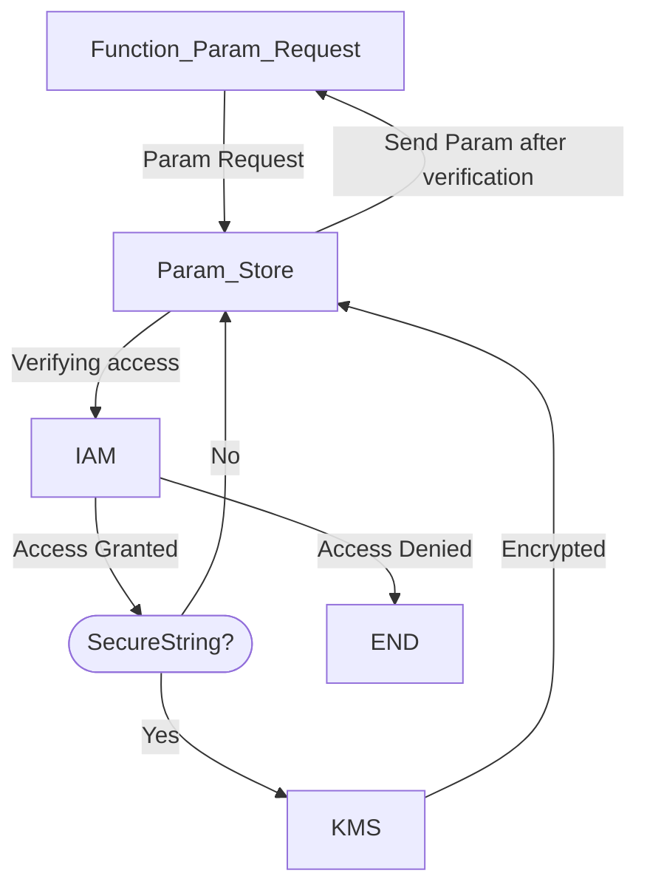

[[SSM|Systems Manager]]
Assists with improving operational integration
- View operation data across multiple services automate tasks across [[EC2]] or [[RDS]]
- Shortens time to detect and resolve operational problems
- Easier scalability

3 Types of Params:
- String
- StringList
- Secure String

Parameter Tiers:

| Type     | Num of Params Allowed | Max size of param value (KB) | Parameter Policies | Cost          |
| -------- | --------------------- | ---------------------------- | ------------------ | ------------- |
| Standard | 10000                 | 4                            | No                 | Free          |
| Advanced | 100000                | 8                            | Yes                | Charges Apply |
[[Parameter Store]]:
- Capability of the [[SSM|Systems Manager]]
- Store and access:
	- Digital authentication credentials
	- Config data
	- Passwords
	- Keys
	- APIs
	- Tokens
- Good for plaintext store
	- If text can't be plaintext, set ==SecureString== 
- Tightly coupled with [[KMS]] for encryption
- Version tracking
- [[IAM]] integration to hide config settings or parameters to certain users

Normal workflow

Hierarchy is simply a parameter name including a path that you define with "/"
- Required when creating hierarchy

Automatically store [[CloudFormation]] parameters in store