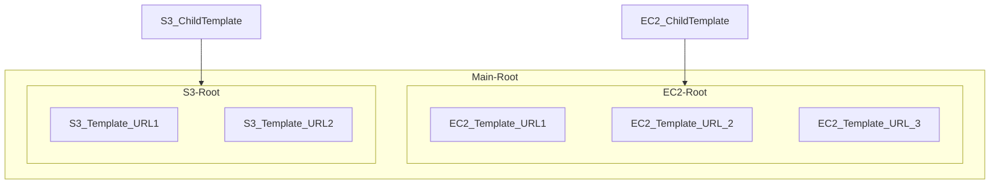

[[Vocabulary/Nested Stacks|Nested Stacks]]

```mermaid
flowchart TD
	EC2_ChildTemplate --> EC2-Root
	
	subgraph EC2-Root
		EC2_Template_URL1 ~~~ EC2_Template_URL_2
		EC2_Template_URL_2 ~~~ EC2_Template_URL_3
	end
	
	S3_ChildTemplate --> S3-Root
	
	subgraph S3-Root
		S3_Template_URL1 ~~~ S3_Template_URL2
	end	
	
	subgraph Main-Root
		S3-Root
		EC2-Root
	end
```
