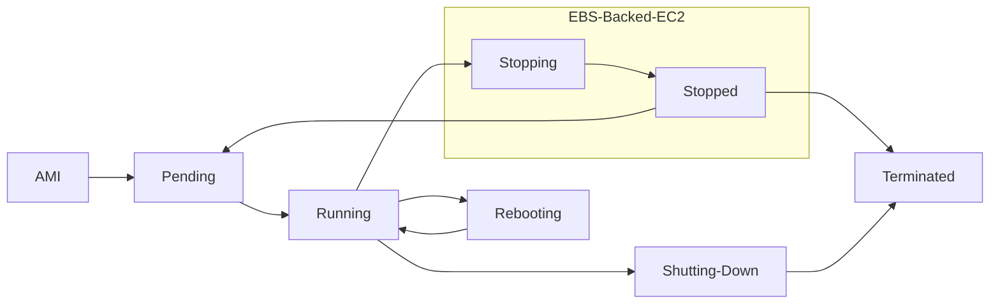

Time for an [[EC2 auto scaling]] instance to complete the lifecycle action before it transitions to next state
Enables ability to suspend or resume scaling processes to do a variety of tasks, like sending logs 
# EC2 Instance Lifecycle

Hook can be placed at Pending or Terminated
- Pending:Wait (scale out event)
	- Ensure [[EC2]] download the latest code base
	- Verify [[Instance user data]] successfully complete first 
- Terminting:Wait (scale in event)
	- Able to upload all data logs before termination
- Both stages can send custom shell scripts, good for auditing